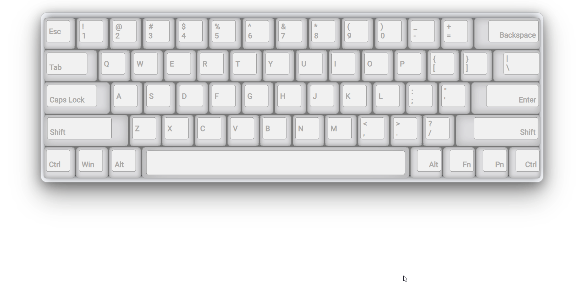

# Keyboard widget

This widget is just a copy of the keyboard. It repeats your keydown events.
___
It can be mounted on any div with "keyboard" id. Screen resize also supported.

### Demo available [here](https://obergodmar.github.io/keyboard)

### Screenshot

